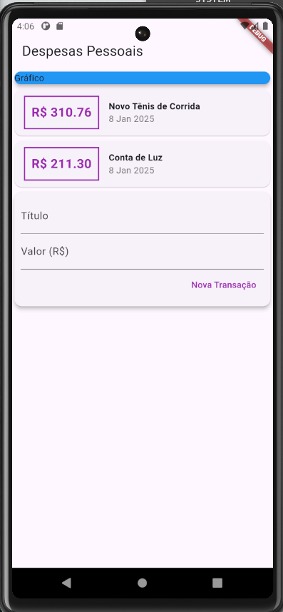

# Despesas Pessoais

Projeto em Flutter, seu intuito é servir como um projeto financeiro de controle de despesas pessoais.

## Notas

O projeto foi desenvolvido ao longo do curso [Aprenda Flutter e Desenvolva Apps Para Android e IOS](https://www.udemy.com/share/102BJd/)

### Demo

